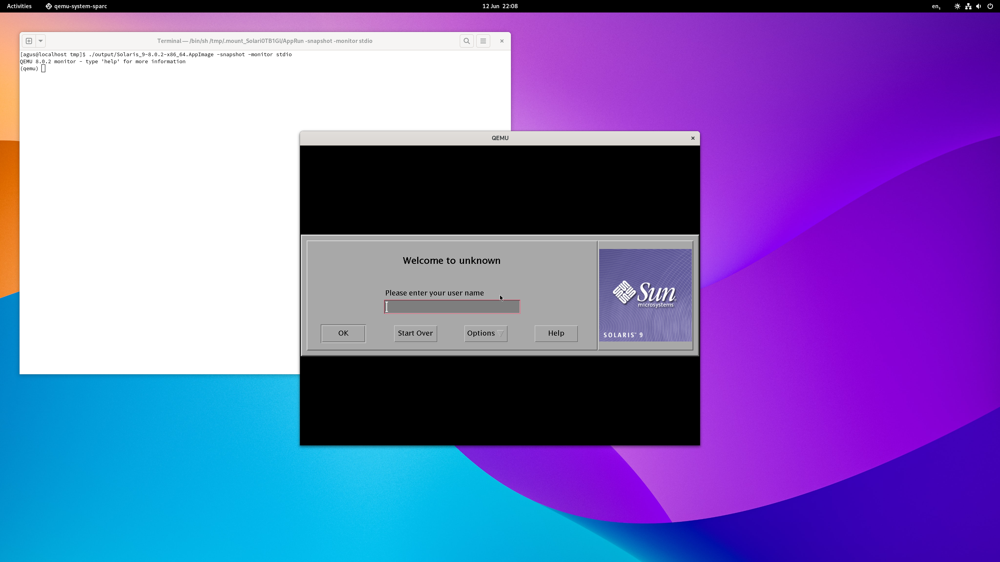
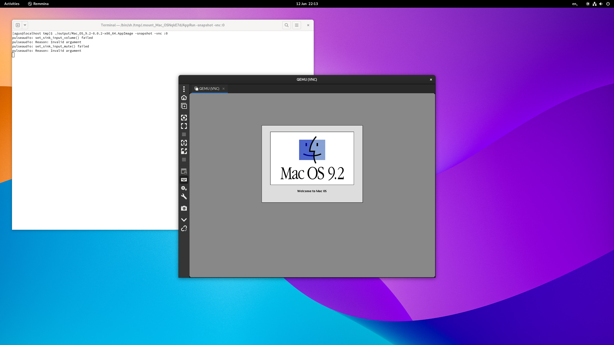

[aguslr/docker-qemu-appimage][1]
================================

[](https://hub.docker.com/r/aguslr/qemu-appimage) [](https://hub.docker.com/r/aguslr/qemu-appimage)


This *Docker* image sets up a container to build QEMU AppImages.


Installation
------------

To use *docker-qemu-appimage*, run the container. Any [argument will be passed
to the `configure` script](#container) before compiling QEMU:

1. Clone and start the container:

       docker run -v "${PWD}"/output:/output \
         docker.io/aguslr/qemu-appimage:latest --target-list=i386-softmmu

2. Run the generated AppImage in `./output`:

       ./output/qemu-system-i386-*.AppImage --version


### Tags

There are two flavors for this docker container:

- `full`, `latest`: Provides libraries to enable most QEMU features. To disable
  any unwanted feature, arguments (e.g. `--disable-gtk`) must be passed to the
  container image.

- `slim`: Provides libraries to enable basic QEMU functionality (e.g., graphics,
  audio, networking, USB, *SPICE*/*VNC* server, etc.)


Variables
---------

The image is configured using environment variables passed at runtime:

| Variable    | Function                    | Default         | Required |
| :---------- | :-------------------------- | :-------------- | -------- |
| `APP_NAME`  | Name of the app to package  | `qemu-system-*` | N        |
| `QEMU_VER`  | Version of QEMU to compile  | `8.0.2`         | N        |
| `QEMU_OPTS` | Custom QEMU runtime options | EMPTY           | N        |

Here's an example to create an AppImage for a Pentium 3 machine with 64 MB of
RAM:

    docker run --rm -e APP_NAME='Pentium 3' -e QEMU_VER='7.2.1' \
      -e QEMU_OPTS='qemu-system-i386 -cpu pentium 3 -m 64' \
      -v "${PWD}"/output:/output \
      docker.io/aguslr/qemu-appimage:latest --target-list=i386-softmmu && \
      ./output/qemu-system-i386-7.2.1-x86_64.AppImage --help


Options
-------

### Container

Any argument for the container image will be passed to [the `configure`
script][2] used to enable or disable QEMU features at build time. For QEMU
version 8.0.2, these are the available options:

<details><summary>Options</summary>

```
Usage: configure [options]
Options: [defaults in brackets after descriptions]

Standard options:
  --help                   print this message
  --prefix=PREFIX          install in PREFIX [/usr]
  --target-list=LIST       set target list (default: build all)
                           Available targets: aarch64-softmmu alpha-softmmu
                           arm-softmmu avr-softmmu cris-softmmu hppa-softmmu
                           i386-softmmu loongarch64-softmmu m68k-softmmu
                           microblaze-softmmu microblazeel-softmmu mips-softmmu
                           mips64-softmmu mips64el-softmmu mipsel-softmmu
                           nios2-softmmu or1k-softmmu ppc-softmmu ppc64-softmmu
                           riscv32-softmmu riscv64-softmmu rx-softmmu
                           s390x-softmmu sh4-softmmu sh4eb-softmmu
                           sparc-softmmu sparc64-softmmu tricore-softmmu
                           x86_64-softmmu xtensa-softmmu xtensaeb-softmmu
  --target-list-exclude=LIST exclude a set of targets from the default target-list

Advanced options (experts only):
  --cross-prefix=PREFIX    use PREFIX for compile tools, PREFIX can be blank []
  --cc=CC                  use C compiler CC [cc]
  --host-cc=CC             use C compiler CC [cc] for code run at
                           build time
  --cxx=CXX                use C++ compiler CXX [c++]
  --objcc=OBJCC            use Objective-C compiler OBJCC [cc]
  --extra-cflags=CFLAGS    append extra C compiler flags CFLAGS
  --extra-cxxflags=CXXFLAGS append extra C++ compiler flags CXXFLAGS
  --extra-objcflags=OBJCFLAGS append extra Objective C compiler flags OBJCFLAGS
  --extra-ldflags=LDFLAGS  append extra linker flags LDFLAGS
  --cross-cc-ARCH=CC       use compiler when building ARCH guest test cases
  --cross-cc-cflags-ARCH=  use compiler flags when building ARCH guest tests
  --cross-prefix-ARCH=PREFIX cross compiler prefix when building ARCH guest test cases
  --make=MAKE              use specified make [make]
  --python=PYTHON          use specified python [/usr/bin/python3]
  --meson=MESON            use specified meson []
  --ninja=NINJA            use specified ninja []
  --smbd=SMBD              use specified smbd []
  --with-git=GIT           use specified git [git]
  --with-git-submodules=update   update git submodules (default if .git dir exists)
  --with-git-submodules=validate fail if git submodules are not up to date
  --with-git-submodules=ignore   do not update or check git submodules (default if no .git dir)
  --static                 enable static build [no]
  --bindir=PATH            install binaries in PATH
  --with-suffix=SUFFIX     suffix for QEMU data inside datadir/libdir/sysconfdir/docdir [qemu]
  --without-default-features default all --enable-* options to "disabled"
  --without-default-devices  do not include any device that is not needed to
                           start the emulator (only use if you are including
                           desired devices in configs/devices/)
  --with-devices-ARCH=NAME override default configs/devices
  --enable-debug           enable common debug build options
  --enable-sanitizers      enable default sanitizers
  --enable-tsan            enable thread sanitizer
  --disable-werror         disable compilation abort on warning
  --disable-stack-protector disable compiler-provided stack protection
  --cpu=CPU                Build for host CPU [x86_64]
  --with-coroutine=BACKEND coroutine backend. Supported options:
                           ucontext, sigaltstack, windows
  --enable-plugins
                           enable plugins via shared library loading
  --disable-containers     don't use containers for cross-building
  --gdb=GDB-path           gdb to use for gdbstub tests []
  --audio-drv-list=CHOICES Set audio driver list [default] (choices: alsa/co
                           reaudio/default/dsound/jack/oss/pa/sdl/sndio)
  --block-drv-ro-whitelist=VALUE
                           set block driver read-only whitelist (by default
                           affects only QEMU, not tools like qemu-img)
  --block-drv-rw-whitelist=VALUE
                           set block driver read-write whitelist (by default
                           affects only QEMU, not tools like qemu-img)
  --datadir=VALUE          Data file directory [share]
  --disable-coroutine-pool coroutine freelist (better performance)
  --disable-hexagon-idef-parser
                           use idef-parser to automatically generate TCG
                           code for the Hexagon frontend
  --disable-install-blobs  install provided firmware blobs
  --docdir=VALUE           Base directory for documentation installation
                           (can be empty) [share/doc]
  --enable-block-drv-whitelist-in-tools
                           use block whitelist also in tools instead of only
                           QEMU
  --enable-cfi             Control-Flow Integrity (CFI)
  --enable-cfi-debug       Verbose errors in case of CFI violation
  --enable-debug-graph-lock
                           graph lock debugging support
  --enable-debug-mutex     mutex debugging support
  --enable-debug-stack-usage
                           measure coroutine stack usage
  --enable-fdt[=CHOICE]    Whether and how to find the libfdt library
                           (choices: auto/disabled/enabled/internal/system)
  --enable-fuzzing         build fuzzing targets
  --enable-gcov            Enable coverage tracking.
  --enable-gprof           QEMU profiling with gprof
  --enable-lto             Use link time optimization
  --enable-malloc=CHOICE   choose memory allocator to use [system] (choices:
                           jemalloc/system/tcmalloc)
  --enable-module-upgrades try to load modules from alternate paths for
                           upgrades
  --enable-profiler        profiler support
  --enable-qom-cast-debug  cast debugging support
  --enable-rng-none        dummy RNG, avoid using /dev/(u)random and
                           getrandom()
  --enable-strip           Strip targets on install
  --enable-tcg-interpreter TCG with bytecode interpreter (slow)
  --enable-trace-backends=CHOICES
                           Set available tracing backends [log] (choices:
                           dtrace/ftrace/log/nop/simple/syslog/ust)
  --firmwarepath=VALUES    search PATH for firmware files [share/qemu-
                           firmware]
  --iasl=VALUE             Path to ACPI disassembler
  --includedir=VALUE       Header file directory [include]
  --interp-prefix=VALUE    where to find shared libraries etc., use %M for
                           cpu name [/usr/gnemul/qemu-%M]
  --libdir=VALUE           Library directory [system default]
  --libexecdir=VALUE       Library executable directory [libexec]
  --localedir=VALUE        Locale data directory [share/locale]
  --localstatedir=VALUE    Localstate data directory [/var/local]
  --mandir=VALUE           Manual page directory [share/man]
  --sphinx-build=VALUE     Use specified sphinx-build for building document
                           [sphinx-build]
  --sysconfdir=VALUE       Sysconf data directory [etc]
  --tls-priority=VALUE     Default TLS protocol/cipher priority string
                           [NORMAL]
  --with-pkgversion=VALUE  use specified string as sub-version of the
                           package
  --with-trace-file=VALUE  Trace file prefix for simple backend [trace]

Optional features, enabled with --enable-FEATURE and
disabled with --disable-FEATURE, default is enabled if available
(unless built with --without-default-features):

  alsa            ALSA sound support
  attr            attr/xattr support
  auth-pam        PAM access control
  avx2            AVX2 optimizations
  avx512bw        AVX512BW optimizations
  avx512f         AVX512F optimizations
  blkio           libblkio block device driver
  bochs           bochs image format support
  bpf             eBPF support
  brlapi          brlapi character device driver
  bzip2           bzip2 support for DMG images
  canokey         CanoKey support
  cap-ng          cap_ng support
  capstone        Whether and how to find the capstone library
  cloop           cloop image format support
  cocoa           Cocoa user interface (macOS only)
  coreaudio       CoreAudio sound support
  crypto-afalg    Linux AF_ALG crypto backend driver
  curl            CURL block device driver
  curses          curses UI
  dbus-display    -display dbus support
  dmg             dmg image format support
  docs            Documentations build support
  dsound          DirectSound sound support
  fuse            FUSE block device export
  fuse-lseek      SEEK_HOLE/SEEK_DATA support for FUSE exports
  gcrypt          libgcrypt cryptography support
  gettext         Localization of the GTK+ user interface
  gio             use libgio for D-Bus support
  glusterfs       Glusterfs block device driver
  gnutls          GNUTLS cryptography support
  gtk             GTK+ user interface
  gtk-clipboard   clipboard support for the gtk UI (EXPERIMENTAL, MAY HANG)
  guest-agent     Build QEMU Guest Agent
  guest-agent-msi Build MSI package for the QEMU Guest Agent
  hax             HAX acceleration support
  hvf             HVF acceleration support
  iconv           Font glyph conversion support
  jack            JACK sound support
  keyring         Linux keyring support
  kvm             KVM acceleration support
  l2tpv3          l2tpv3 network backend support
  libdaxctl       libdaxctl support
  libdw           debuginfo support
  libiscsi        libiscsi userspace initiator
  libnfs          libnfs block device driver
  libpmem         libpmem support
  libssh          ssh block device support
  libudev         Use libudev to enumerate host devices
  libusb          libusb support for USB passthrough
  libvduse        build VDUSE Library
  linux-aio       Linux AIO support
  linux-io-uring  Linux io_uring support
  live-block-migration
                  block migration in the main migration stream
  lzfse           lzfse support for DMG images
  lzo             lzo compression support
  malloc-trim     enable libc malloc_trim() for memory optimization
  membarrier      membarrier system call (for Linux 4.14+ or Windows
  mpath           Multipath persistent reservation passthrough
  multiprocess    Out of process device emulation support
  netmap          netmap network backend support
  nettle          nettle cryptography support
  numa            libnuma support
  nvmm            NVMM acceleration support
  opengl          OpenGL support
  oss             OSS sound support
  pa              PulseAudio sound support
  parallels       parallels image format support
  png             PNG support with libpng
  pvrdma          Enable PVRDMA support
  qcow1           qcow1 image format support
  qed             qed image format support
  qga-vss         build QGA VSS support (broken with MinGW)
  rbd             Ceph block device driver
  rdma            Enable RDMA-based migration
  replication     replication support
  sdl             SDL user interface
  sdl-image       SDL Image support for icons
  seccomp         seccomp support
  selinux         SELinux support in qemu-nbd
  slirp           libslirp user mode network backend support
  slirp-smbd      use smbd (at path --smbd=*) in slirp networking
  smartcard       CA smartcard emulation support
  snappy          snappy compression support
  sndio           sndio sound support
  sparse          sparse checker
  spice           Spice server support
  spice-protocol  Spice protocol support
  tcg             TCG support
  tools           build support utilities that come with QEMU
  tpm             TPM support
  u2f             U2F emulation support
  usb-redir       libusbredir support
  vde             vde network backend support
  vdi             vdi image format support
  vduse-blk-export
                  VDUSE block export support
  vfio-user-server
                  vfio-user server support
  vhost-crypto    vhost-user crypto backend support
  vhost-kernel    vhost kernel backend support
  vhost-net       vhost-net kernel acceleration support
  vhost-user      vhost-user backend support
  vhost-user-blk-server
                  build vhost-user-blk server
  vhost-vdpa      vhost-vdpa kernel backend support
  virglrenderer   virgl rendering support
  virtfs          virtio-9p support
  vmnet           vmnet.framework network backend support
  vnc             VNC server
  vnc-jpeg        JPEG lossy compression for VNC server
  vnc-sasl        SASL authentication for VNC server
  vte             vte support for the gtk UI
  vvfat           vvfat image format support
  whpx            WHPX acceleration support
  xen             Xen backend support
  xen-pci-passthrough
                  Xen PCI passthrough support
  xkbcommon       xkbcommon support
  zstd            zstd compression support
  system          all system emulation targets
  user            supported user emulation targets
  linux-user      all linux usermode emulation targets
  bsd-user        all BSD usermode emulation targets
  pie             Position Independent Executables
  modules         modules support (non-Windows)
  debug-tcg       TCG debugging (default is disabled)
  debug-info      debugging information
  safe-stack      SafeStack Stack Smash Protection. Depends on
                  clang/llvm and requires coroutine backend ucontext.

NOTE: The object files are built at the place where configure is launched
```
</details>


### AppImage

The generated AppImages accept these arguments:

| Option                | Function                                |
|:--------------------- |:--------------------------------------- |
| `--command=list`      | List available binaries inside AppImage |
| `--command=<command>` | Run specific binary inside AppImage     |


Additionally, AppImages accept a few options by default:

| Option                           | Function                                                                                          |
|:-------------------------------- |:------------------------------------------------------------------------------------------------- |
| `--appimage-extract [<pattern>]` | Extract content from embedded filesystem image. If pattern is passed, only extract matching files |
| `--appimage-help`                | Print this help                                                                                   |
| `--appimage-mount`               | Mount embedded filesystem image and print mount point and wait for kill with Ctrl-C               |
| `--appimage-offset`              | Print byte offset to start of embedded  image                                                     |
| `--appimage-portable-home`       | Create a portable home folder to use as $HOME                                                     |
| `--appimage-portable-config`     | Create a portable config folder to use as $XDG_CONFIG_HOME                                        |
| `--appimage-signature`           | Print digital signature embedded in AppImage                                                      |
| `--appimage-updateinfo[rmation]` | Print update info embedded in AppImage                                                            |
| `--appimage-version`             | Print version of AppImageKit                                                                      |


Any other argument will be passed [directly to the QEMU binary][8] (e.g.,
`qemu-system-x86_64`).


Custom Virtual Machines
-----------------------

We can place disk images (QCOW2, ISO, raw images, etc.) or BIOS files (BIN, ROM)
in an `input` directory and they will be copied and loaded at runtime:

| Filename    | Function    | Device   |
| :---------- | :---------- | :------- |
| `bios.rom`  | BIOS file   | `-bios`  |
| `fda.img`   | Floppy disk | `-fda`   |
| `cdrom.iso` | CD-ROM      | `-cdrom` |
| `hda.qcow2` | Hard drive  | `-hda`   |

**Note**: The hard drive file will be read-only therefore, unless we pass the
`-snapshot` argument to the AppImage, [changes to the disk][3] will be saved to
a *QCOW2* image in a directory named after the AppImage inside
`${XDG_DATA_HOME}/qemu.appimage` (usually `~/.local/share/qemu.appimage`).


### Examples

- Disable VNC support in QEMU and create an AppImage for a *Sun Solaris 9* disk
  (`./input/hda.qcow2`):

       docker run --rm -e APP_NAME='Solaris 9' \
         -e QEMU_OPTS='qemu-system-sparc -M SS-5 -m 256 -vga cg3 -g 1024x768' \
         -v "${PWD}"/input:/input -v "${PWD}"/output:/output \
         docker.io/aguslr/qemu-appimage:latest \
         --target-list=sparc-softmmu --disable-vnc && \
         ./output/Solaris_9-8.0.2-x86_64.AppImage -snapshot -monitor stdio

<picture>
  <source media="(prefers-color-scheme: light)" srcset="screenshots/solaris9-light.png">
  <source media="(prefers-color-scheme: dark)"  srcset="screenshots/solaris9-dark.png">
  
</picture>

- Disable *PulseAudio* and *SLiRP* support in QEMU and create an AppImage for a
  *Mac OS 9* disk (`./input/hda.qcow2`):

       docker run --rm -e APP_NAME='Mac OS 9.2' \
         -e QEMU_OPTS='qemu-system-ppc -machine mac99 -m 256 -nic none -g 1024x768x32' \
         -v "${PWD}"/input:/input -v "${PWD}"/output:/output \
         docker.io/aguslr/qemu-appimage:latest \
         --target-list=ppc-softmmu --disable-pa --disable-slirp && \
         ./output/Mac_OS_9.2-8.0.2-x86_64.AppImage -snapshot -vnc :0

<picture>
  <source media="(prefers-color-scheme: light)" srcset="screenshots/macos9-light.png">
  <source media="(prefers-color-scheme: dark)"  srcset="screenshots/macos9-dark.png">
  
</picture>


Build locally
-------------

Instead of pulling the image from a remote repository, you can build it locally:

1. Clone the repository:

       git clone https://github.com/aguslr/docker-qemu-appimage.git

2. Change into the newly created directory and use `docker-compose` to build and
   launch the container:

       cd docker-qemu-appimage && docker-compose up --build -d


References
----------

- [qemu-ppc/.travis.yml at master · probonopd/qemu-ppc · GitHub][4]
- [qemu-img Backing Files: A Poor Man's Snapshot/Rollback - A Random Walk Down
  Tech Street][3]
- [14.9. Rebasing a Backing File of an Image Red Hat Enterprise Linux 7 | Red
  Hat Customer Portal][5]
- [QEMU disk image utility — QEMU documentation][6]


[1]: https://github.com/aguslr/docker-qemu-appimage
[2]: https://github.com/qemu/qemu/blob/45ae97993a75f975f1a01d25564724c7e10a543f/configure#L831
[3]: http://web.archive.org/web/http://dustymabe.com/2015/01/11/qemu-img-backing-files-a-poor-mans-snapshotrollback/
[4]: https://github.com/probonopd/qemu-ppc/blob/master/.travis.yml
[5]: https://access.redhat.com/documentation/en-us/red_hat_enterprise_linux/7/html/virtualization_deployment_and_administration_guide/sect-using_qemu_img-re_basing_a_backing_file_of_an_image
[6]: https://qemu.readthedocs.io/en/latest/tools/qemu-img.html
[7]: https://access.redhat.com/documentation/es-es/red_hat_enterprise_linux/7/html/virtualization_deployment_and_administration_guide/sect-graphic_user_interface_tools_for_guest_virtual_machine_management-remote_viewer
[8]: https://www.qemu.org/docs/master/system/qemu-manpage.html
